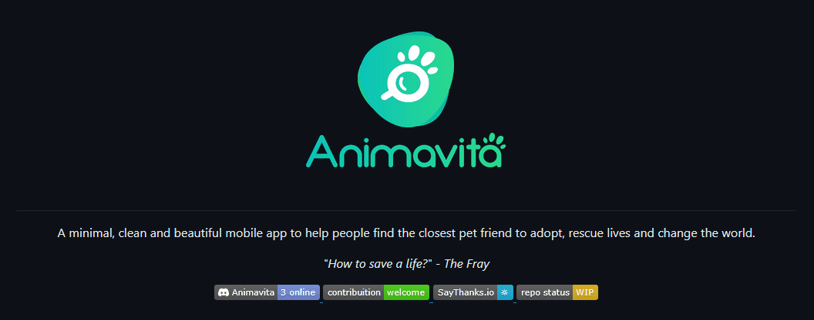

# Projeto com README
Um projeto de teste com um arquivo README 🚀

[](https://google.com.br)

## Tecnologias utilizadas
- HTML
- CSS
- JS

## Como utilizar

Clone pro projeto
```
Git Clone <url>
```

Acesse a pasta do projeto
```
cd repositorio-com-readme
```
